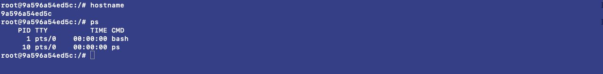
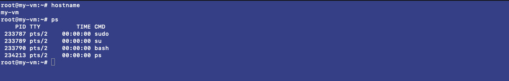
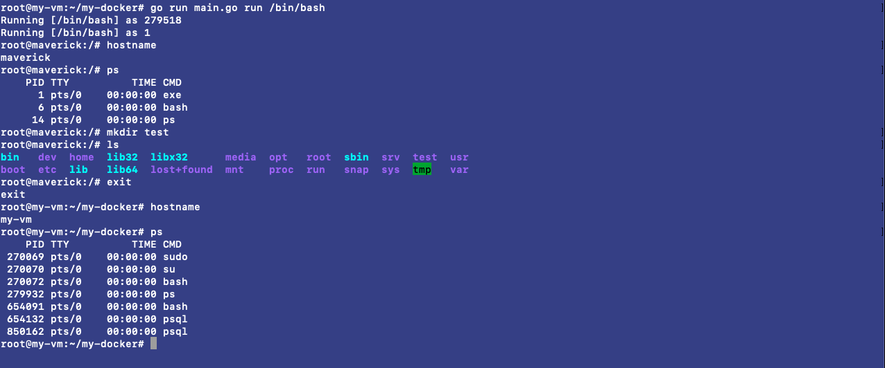

# Creating your own Docker with Go
Docker, and the containers it makes has completely changed the way of packaging applications and deploying them. It helps injecting our source code with mobility to run at scale. I use Docker for practically everthing on my laptop, creating local development environments, testing environments and using disposable containers for doing some crazy stuff and deleting them right away if things get messy😅. I am sure that everyone who has ever used Docker must be amazed that how a single command, let us create isolated and independent machines(called containers) within a few seconds. <br><br>
Let's understand this magic while implementing our own **Docker** with a few lines of some awesome **Go** code.

## What we'll do?
At the end of this post we'll be having a Go binary that would be capable of running any valid linux command/executable inside an isolated process(practically known as container).
```bash
docker         run 	 image          <cmd> <params>
go run main.go run   {some command}     <cmd> <params>
```

## Requirements
- **Go sdk**(Linux)
- Any **Linux** distribution
- **Docker** for linux<br>
Linux is required because containers are practically a wrap around Linux technologies that we'll be exploring next.

## Some Linux technologies
- **Namespaces** - what an isolated process can see is defined and controlled by namespaces. It creates isolation by providing each process it's own pseudo environment.
- **Chroots** - it control root filesystem for each process.
- **Cgroups** - what an isloted process can use as resource from host machine is enforced by cgroups.

## A bit about Namespaces
Namespaces provide the isolation needed to run multiple containers on one machine while giving each what appears like it’s own environment. We have following 6 namespaces thus providing different levels and kinds of isolation.

- Unix Timesharing System
- Process IDs
- Mounts
- Networks
- User IDs
- InterProcess Communication

## Container v/s Host
Enough with theory and definitions, now let's actually see how a container behaves differently from host machine.<br><br>
We'll create an ubuntu docker container passing `/bin/bash` as entrypoint. Use the following snippet.
```bash
docker run -it --rm ubuntu /bin/bash
```
We'll run a few Linux commands inside our container(ubuntu 20.04) and host machine(ubuntu 20.04) and observer their behaviour inside both environments:

- **hostname** - return name of the host inside which bash is running.
- **ps** - return list of active process running inside the environment.

**container**


**host**


We can see that, when we run same commands in docker container and our host machine we get different results.
- Container is assigned a hostname from docker(container ID), while our system have a completely different hostname.
- Lots of process are running inside our host but our container is only aware of process running inside it, thus providing isolation.

## Let's dive deep
We have got a taste of a how these containers function. It's time to open our editor and write some go code to achieve something similar that docker does.<br><br>
Create a `main.go` file with main package and start adding the following components. Do read the comments mentioned in snippet for understanding significance of each line.

- **command switch**
```go
func main() {
	switch os.Args[1] {
	case "run":
		run()
	case "child":
		child()
	default:
		panic("invalid command")
	}
}
```
The command switch picks the command-line argument passed, and runs the function mapped to that argument.

- **run function**
```go
func run() {
	fmt.Printf("Running %v as %d\n", os.Args[2:], os.Getpid())
	// proc dir is a directory where all processes metadata is there
	// our temporary binary will also be present here
	// below line executes child function inside the newly created container
	cmd := exec.Command("/proc/self/exe", append([]string{"child"}, os.Args[2:]...)...)
        // attatching os-std process to our cmd-std process
	cmd.Stdin = os.Stdin
	cmd.Stdout = os.Stdout
	cmd.Stderr = os.Stderr

        // setting some system process attributes
        // below line of code is responsible for creating a new isolated process
	cmd.SysProcAttr = &syscall.SysProcAttr{
		// Cloning is what creates the process(container) in which we would be running our command.
		// CLONE_NEWUTS will allow to have our own hostname inside our container by creating a new unix timesharing system.
		// CLONE_NEWPID assigns pids to only process inside the new namspace.
		// CLONE_NEWNS new namespace for mount.
		Cloneflags: syscall.CLONE_NEWUTS | syscall.CLONE_NEWPID | syscall.CLONE_NEWNS,
		// Mounts in systemd gets recursively shared property.
		// Unshare the recursively shared property for new mount namespace.
		// It prevents sharing of new namespace with the host.
		Unshareflags: syscall.CLONE_NEWNS,
	}

        // running the command and catching error
	if err := cmd.Run(); err != nil {
		log.Fatal("Error: ", err)
	}
}
```
The `run()` function is responsible for creating an isolated process(container) and then execute itself inside this isolated process, this time invoking `child()` function

- **child function**
```go
func child() {
	fmt.Printf("Running %v as %d\n", os.Args[2:], os.Getpid())
        // below are some system calls that set some container properties
	// sets hostname for newly created namespace
	must(syscall.Sethostname([]byte("maverick")))
        // setting root director for the container
	must(syscall.Chroot("/"))
        // making "/" as default dir
	must(syscall.Chdir("/"))
        // mounting proc dir to see the process running inside container
	must(syscall.Mount("proc", "proc", "proc", 0, ""))

        // below line finally executes the user-command inside our own created container!
	cmd := exec.Command(os.Args[2], os.Args[3:]...)
        // attatching os-std process to our cmd-std process
	cmd.Stdin = os.Stdin
	cmd.Stdout = os.Stdout
	cmd.Stderr = os.Stderr

        // running the command and catching error
	if err := cmd.Run(); err != nil {
		log.Fatal("Error: ", err)
	}
        // unmount the proc after command is finished
	syscall.Unmount("/proc", 0)
}
```
The `child()` function is invoked by `run()` as a child process inside container created by `run()`. It is responsible for some **system calls** for setting some container properties and finally execute the command dispatched from user.

- **must function**
```go
func must(err error) {
	if err != nil {
		panic(err)
	}
}
```
The `must()` is a simple error wrapper that panics if any system call invoked inside child function fails.

## Let's create some containers
Now that we have a mini docker program that can actually create isolated and independent containers on your host machine. Let use our powerful tool.<br>
<br>
The command that we would be running inside our container is `/bin/bash`, that will start a new bash program inside our container.<br>
<br>
Run following snippet to create the container.
```bash
go run main.go run /bin/bash
```


When we run the above command passing `/bin/bash` as argument following changes happen<br>

- a new container is created running a bash process in isolation to the system.
- `Running [/bin/bash] as 279518` means our bash process running in the container has a **pid** of 279518 on host, while `Running [/bin/bash] as 1` is the **pid** of the same process inside our container.
- both `root@maverick` and hostname command tells us that hostname of our container is maverick, that is passed as *systemcall* by our Go program.
- running `ps` return only the process running inside our container and has no information about other system processes.
- since we mounted the `root dir` of our host machine as `Chroot` of our container, upon running `ls` we can see all those root files.

Now we are sure that our bash is running as an isolated process, let's `exit` from it and observe come changes.<br>
- upon exit we kill our container and return back to host machine
- hostname and ps return different metrics and values that represents our host machine.

## Understanding the Chroots
In above execution we mounted root directory of host machine as our container's `root dir`. This practically gives all executables and metadata which our host machine holds, thus creating a vulnerability. A better approach to this, could be creating a pseudo root directory with stripped down executable and thus mounting is as container's `root dir`.

## Conclusion
We have successfully created a Go program that runs a Linux executable as an isolated container with it's own hostname, own process management and pseudo `root-dir`. For creating a fully isolated and independent container similar to a Docker container we'll have to touch all six namespaces, configure all Cgroups, dynamically create Chroots for every container and do layer caching which is beyond the scope of this article.<br>
<br>

I hope this article helped you understand how docker works and how it wraps cool pieces of technology that comes with linux kernel.<br>
<br>

For an in-depth understanding of *how docker works?*, I would recommend you to check **containers from scratch** by *Liz Rice*.

## Author
**Akshit Sadana <akshitsadana@gmail.com>**

- Github: [@Akshit8](https://github.com/Akshit8)
- LinkedIn: [@akshitsadana](https://www.linkedin.com/in/akshit-sadana-b051ab121/)
